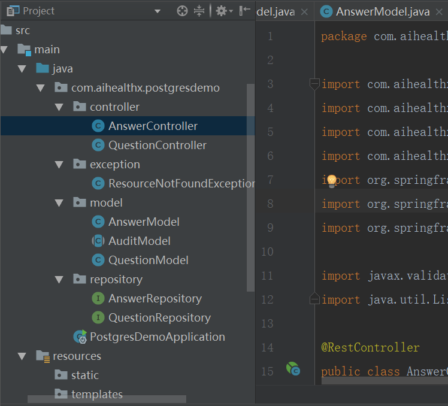

<<<<<<< HEAD
# postgres-demo
=======
# Spring Boot, PostgreSQL, JPA, Hibernate 构建 RESTful 增删改查API 

在这篇文章中，你会学到如何通过配置`Spring Boot` 来使用`PostgresSQL`数据库，从而构建一个具有`RESTful`特点的、具有增删改查功能的`API`，这个demo项目是一个在线问答的程序，具有两个Domain Model- `Question` 和 `Answer` 因为问题可以有很多答案，所以这个两个Domain Model 是一对多的关系。

我们首先要启动建立这个项目，然后配置PostgreSQL数据库，然后我们就可以定义上面两个Domain Model，然后定义访问数据的操作。最后我们编写REST API。并用PostMan来测试。

## 启动一个Spring Boot项目
可以按照下面的步骤来建立一个Spring Boot项目
* 打开 [http://start.spring.io]( http://start.spring.io)
* 输入**postgres-demo**，选择**gradle**构建。
* 增加 **Web**，**JPA** 和**PostgreSQL**依赖。
* 点击创建项目后，项目会自动下载到本地。


## 项目的架构目录
下面是这个Demo项目的架构目录，我们之后要在这里一个一个的创建我们所需要的包和类。



## 在`application.properties` 中配置`Postgresql`
重中之重，让我们来配置PostgreSQL数据源，可以直接在`src/main/resource/application.properties`文件中配置

```
## Spring DATASOURCE(DataSourceAutoConfiguration & DataSourceProperties)
spring.datasource.url=jdbc:postgresql://localhost:5432/postgres_demo
spring.datasource.username=postgres
spring.datasource.password=aihealthx

# Hibernate ddl auto(create, create-drop,validate,update)
spring.jpa.hibernate.ddl-auto=update

# Disable feature detection by this undocumented parameter. Check the org.hibernate.engine.jdbc.internal.JdbcServiceImpl.configure method for more details.
spring.jpa.properties.hibernate.temp.use_jdbc_metadata_defaults = false

# Because detection is disabled you have to set correct dialect by hand.
spring.jpa.database-platform=org.hibernate.dialect.PostgreSQL9Dialect

```
后两条属性是用来配置`Hibernate`的,这是默认的 **JPA vendor**

`ddl-auto` 属性是用来自动创建相应的数据库表。

## 定义数据库模型-Question 和 Answer
**Domain Model** 是一些用来映射数据库表的一些相关的类，这个不必多说。我们将要创建两个**Domain Model** `Question` 和 `Answer` 并且这两个模型都具有共同的数据字段 `createAt` *创建时间* 和 `updateAt` *更改时间*。

因为具有相同的字段属性，我们可以把相同字段属性，抽象到另外一个基类中，这样通过继承，使得Answer 和 Question都具有这两个属性。因此我们创建了一个抽象类叫做AuditModel。

并且，我们还可以利用Spring boot的 **[JPA Auditing](https://docs.spring.io/spring-data/jpa/docs/current/reference/html/#jpa.auditing)** 的特性，在当相关实体数据有字段插入或者更新的时候自动更新填写`createAt`和`updateAt`。
### 1. AuditModel

下面的这个`AuditModel` 类将会被其他实体类继承。它包含了`@EntityListeners(AuditingEntityListener.class)` 注解，用来自动填写 `createAt` 和 `updateAt`字段值，我们还利用一些其他的注解来限制数据字段。

```
package com.aihealthx.postgresdemo.model;

import com.fasterxml.jackson.annotation.JsonIgnoreProperties;
import org.springframework.data.annotation.CreatedDate;
import org.springframework.data.annotation.LastModifiedDate;
import org.springframework.data.jpa.domain.support.AuditingEntityListener;

import javax.persistence.*;
import java.io.Serializable;
import java.util.Date;

@MappedSuperclass
@EntityListeners(AuditingEntityListener.class)
@JsonIgnoreProperties(
        value = {"createAt", "updateAt"},
        allowGetters = true
)
public abstract class AuditModel  implements Serializable{
    @Temporal(TemporalType.TIMESTAMP)
    @Column(name = "created_at", nullable = false, updatable = false)
    @CreatedDate
    private Date createAt;

    @Temporal(TemporalType.TIMESTAMP)
    @Column(name="update_at", nullable = false)
    @LastModifiedDate
    private Date updateAt;
    
    // Getters and Setters (Omitted for brevity)
}

```
#### 启动 **JPA Auditing**
记住，为了启用JPA Auditing的功能，你需要增加`@EnableJpaAuditing`注解到任何一个配置类中，因此打开主类入口`PostgresDemoApplication.java` 增加`@EnableJpaAuditing` 注解

```
package com.example.postgresdemo;

import org.springframework.boot.SpringApplication;
import org.springframework.boot.autoconfigure.SpringBootApplication;
import org.springframework.data.jpa.repository.config.EnableJpaAuditing;

@SpringBootApplication
@EnableJpaAuditing
public class PostgresDemoApplication {
    public static void main(String[] args) {
        SpringApplication.run(PostgresDemoApplication.class, args);
    }
}
```
### Question Model
下面就是我们的 `Question` 实体类，它映射了数据库的`questions`表
```
package com.aihealthx.postgresdemo.model;

import javax.persistence.Column;
import javax.persistence.GeneratedValue;
import javax.persistence.Id;
import javax.persistence.SequenceGenerator;
import javax.validation.constraints.NotBlank;
import javax.validation.constraints.Size;

public class QuestionModel extends AuditModel {
    @Id
    @GeneratedValue(generator = "question_generator")
    @SequenceGenerator(
            name = "question_generator",
            sequenceName = "question_sequence",
            initialValue = 1000
    )
    private Long id;

    @NotBlank
    @Size(min = 3,max=100)
    private String title;

    @Column(columnDefinition = "text")
    private String description;
    
    // Getters and Setters (Omitted for brevity)
}
```
注意，这里我利用 @SequenceGenerator 来生成问题Id，你可以通过`@GeneratedValue(strategy=GenerationType.IDENTITY)` 来配置。但是这里一个 **SenquenceGenerator** 看起来更好。

### 3. Answer model
如下是一个`Answer model` 类，包含一个``@ManyToOne``注解来声明 `Answer` 实体类与`Question`实体类具有相同的多对一的关系。

```
package com.aihealthx.postgresdemo.model;

import com.fasterxml.jackson.annotation.JsonIgnore;
import org.hibernate.annotations.OnDelete;
import org.hibernate.annotations.OnDeleteAction;

import javax.persistence.*;

@Entity
@Table(name = "answers")
public class AnswerModel extends AuditModel {
    @Id
    @GeneratedValue(generator = "answer_generator")
    @SequenceGenerator(
            name = "answer_generator",
            sequenceName = "answer_sequence",
            initialValue = 1000
    )
    private Long id;
    
    @Column(columnDefinition = "text")
    private String text;
    
    @ManyToOne(fetch = FetchType.LAZY)
    @JoinColumn(name = "question_id", nullable = false)
    @OnDelete(action = OnDeleteAction.CASCADE)
    @JsonIgnore
    private QuestionModel question;
    // Getters and Setters (Omitted for brevity)
}

```

## 数据操作仓库定义
下面的 repositories 封装了对数据库访问的控制，即对PostgreSQL数据库的增删改查

### 1. QuestionRepository
```
package com.aihealthx.postgresdemo.repository;

import com.aihealthx.postgresdemo.model.QuestionModel;
import org.springframework.data.jpa.repository.JpaRepository;

public interface QuestionRepository extends JpaRepository<QuestionModel,Long> {}

```
### 2. AnswerRepository
```
package com.aihealthx.postgresdemo.repository;

import com.aihealthx.postgresdemo.model.AnswerModel;
import org.springframework.data.jpa.repository.JpaRepository;

import java.util.List;

public interface AnswerRepository extends JpaRepository<AnswerModel,Long> {
    List<AnswerModel> findByQuestionId(Long questionId);
}

```

## 构建 REST API

最后我们在 **Controller** 里面编写 **REST API** ，坚持一个**Model**对应一个 Controller原则，也是**单一职责原则**的体现。

### 1. QuestionController
```
package com.aihealthx.postgresdemo.controller;

import com.aihealthx.postgresdemo.exception.ResourceNotFoundException;
import com.aihealthx.postgresdemo.model.QuestionModel;
import com.aihealthx.postgresdemo.repository.QuestionRepository;
import org.springframework.beans.factory.annotation.Autowired;
import org.springframework.data.domain.Page;
import org.springframework.data.domain.Pageable;
import org.springframework.http.ResponseEntity;
import org.springframework.web.bind.annotation.*;

import javax.validation.Valid;

@RestController
public class QuestionController {
    @Autowired
    private QuestionRepository questionRepository;

    @GetMapping("/questions")
    public Page<QuestionModel> getQuestions(Pageable pageable) {
        return questionRepository.findAll(pageable);
    }

    @PostMapping("/questions")
    public QuestionModel createQuestion(@Valid @RequestBody QuestionModel questionModel) {
        return questionRepository.save(questionModel);
    }

    @PutMapping("/questions/{questionId}")
    public QuestionModel updateQuestion(@PathVariable Long questionId, @Valid @RequestBody QuestionModel questionRequest) {
        return questionRepository.findById(questionId)
                .map(question -> {
                    question.setTitle(questionRequest.getTitle());
                    question.setDescription(questionRequest.getDescription());
                    return questionRepository.save(question);
                }).orElseThrow(() -> new ResourceNotFoundException("Question not found with id " + questionId));
    }

    @DeleteMapping("/questions/{questionId}")
    public ResponseEntity<?> deleteQuestion(@PathVariable Long questionId) {
        return questionRepository.findById(questionId)
                .map(questionModel -> {
                    questionRepository.delete(questionModel);
                    return ResponseEntity.ok().build();
                }).orElseThrow(() -> new ResourceNotFoundException("Question not found with id " + questionId));
    }
}

```
### 2. AnswerController
```
package com.aihealthx.postgresdemo.controller;

import com.aihealthx.postgresdemo.exception.ResourceNotFoundException;
import com.aihealthx.postgresdemo.model.AnswerModel;
import com.aihealthx.postgresdemo.repository.AnswerRepository;
import com.aihealthx.postgresdemo.repository.QuestionRepository;
import org.springframework.beans.factory.annotation.Autowired;
import org.springframework.http.ResponseEntity;
import org.springframework.web.bind.annotation.*;

import javax.validation.Valid;
import java.util.List;

@RestController
public class AnswerController {

    @Autowired
    private AnswerRepository answerRepository;
    @Autowired
    private QuestionRepository questionRepository;

    @GetMapping("/questions/{questionId}/answers")
    public List<AnswerModel> getAnswersByQuestionId(@PathVariable Long questionId) {
        return answerRepository.findByQuestionId(questionId);
    }

    @PostMapping("/questions/{questionId}/answers")
    public AnswerModel addAnswer(@PathVariable Long questionId, @Valid @RequestBody AnswerModel answer) {
        return questionRepository.findById(questionId)
                .map(questionModel -> {
                    answer.setQuestion(questionModel);
                    return answerRepository.save(answer);
                }).orElseThrow(() -> new ResourceNotFoundException("Question not found with id " + questionId));
    }

    @PutMapping("/questions/{questionId}/answers/{answerId}")
    public AnswerModel updateAnswer(@PathVariable Long questionId, @PathVariable Long answerId, @Valid @RequestBody AnswerModel answerRequest) {
        if (!questionRepository.existsById(questionId)) {
            throw new ResourceNotFoundException("Question not found with id " + questionId);
        }

        return answerRepository.findById(answerId)
                .map(answerModel -> {
                    answerModel.setText(answerRequest.getText());
                    return answerRepository.save(answerModel);
                }).orElseThrow(() -> new ResourceNotFoundException("Answer not found with id " + answerId));
    }

    @DeleteMapping("/questions/{questionId}/answers/{answerId}")
    public ResponseEntity<?> deleteAnswer(@PathVariable Long questionId, @PathVariable Long answerId) {
        if (!questionRepository.existsById(questionId)) {
            throw new ResourceNotFoundException("Question not found with id " + questionId);
        }
        return answerRepository.findById(answerId)
                .map(answerModel -> {
                    answerRepository.delete(answerModel);
                    return ResponseEntity.ok().build();
                }).orElseThrow(() -> new ResourceNotFoundException("Answer not found with id " + answerId));
    }
}

```
### 自定义异常类 `ResourceNotFoundException`
在上述 **Rest API** 中，如果未找到问题或者回答，那么后台代码会抛出 `ResourceNotFoundException` 异常，下面是这个异常类的定义

```
package com.aihealthx.postgresdemo.exception;

import org.springframework.http.HttpStatus;
import org.springframework.web.bind.annotation.ResponseStatus;

@ResponseStatus(HttpStatus.NOT_FOUND)
public class ResourceNotFoundException extends RuntimeException {
    public ResourceNotFoundException(String message) {
        super(message);
    }
    public ResourceNotFoundException(String message, Throwable cause) {
        super(message, cause);
    }
}

```
**值得注意的是**，这个类包含了一个 `ResponseStatus(HttpStatus.NOT_FOUND)` 注解，这样当后台抛出这个异常时候，Spring Boot 会给用户返回404错误。

## 最后运行程序，使用PostMan进行测试
>>>>>>> Spring boot With PostgreSQL
